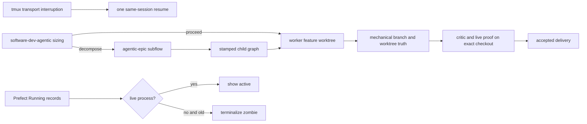

# PO self-decomposition and runtime reliability

## Goal

Make a substantive `po run software-dev-agentic` remain autonomous when its sizing judge decides the seed is too broad. The run must turn that judgment into the existing `agentic-epic` planning, child creation, dependency wiring, dispatch, integration, and acceptance workflow without requiring Ryan to inspect a failed run and relaunch it manually.

The same change set should repair the runtime-truth failures observed in the July 16 batch: an active worker shown as stale because only its seed run directory was inspected, a tmux-backed model turn that disappeared before writing an exit-code file, old Prefect `Running` records that the recent-only reconciler never terminalizes, proof roles that inspect the unchanged seed checkout instead of the worker branch worktree, and a status CLI that rejects the natural `po status ISSUE_ID` form.

Tracked by epic `prefect-orchestration-8gfd` and children `prefect-orchestration-2plr`, `prefect-orchestration-21he`, `prefect-orchestration-3m8k`, `prefect-orchestration-2qf6`, and `prefect-orchestration-3stb`.

## Current system

`software-dev-agentic` asks the `agentic-sizer` model for a structured `sizing.json`. Python validates that artifact and applies the operator iteration cap. A `proceed` decision enters the normal actor/critic and proof loop. A `decompose` decision currently raises `DecompositionRequiredError`, records the delivery as rejected, and leaves the operator-facing flow Failed with a message telling the human to invoke `agentic-epic`.

`agentic-epic` already supplies the missing continuation. It scopes the seed into a PRD, has a model plan and critique the child graph, creates and stamps child beads, records model-declared ordering as dependency edges, dispatches the graph, integrates accepted children into one epic branch, and runs assembled acceptance. It also has an idempotency guard that reuses existing children on repeat dispatch.

Core tmux backends stream model output to `.tmux/*.out` and write `.rc` from the wrapper shell. `_wait_for_rc` currently raises a generic `RuntimeError` as soon as a tmux target disappears without the `.rc`, even when structured output contains a provider thread/session ID or an explicit terminal event. `AgentSession` only retries typed capacity failures, not recoverable transport interruption.

`po status` computes staleness from the seed run directory and renders the stale annotation without considering the separately available live-process check. `po reconcile` correctly refuses to touch a stale run with a live process, but only queries the last 24 hours; older zombie `Running` records remain in Prefect indefinitely.

After branch truth is established, only preview validation resolves the registered worker worktree. Reviewer, deploy-smoke, demo, artifact, and verifier contexts keep receiving the seed checkout path, so a successful role can accidentally prove old code. Separately, `po status` exposes only an option-form issue filter even though the issue is the command's natural primary operand.

## Feasibility and constraints

The decomposition continuation is feasible without a new formula or CLI verb. A lazy import avoids the existing `agentic_epic -> agentic` module dependency, and calling the decorated epic flow creates a real Prefect subflow rather than a detached process. The original seed can serve as the epic root because beads parent-child structure is dependency-based rather than restricted by the issue type.

ZFC remains intact: models judge scope, child boundaries, dependencies, and acceptance. Python only validates structured decisions, invokes an existing flow, persists metadata, and enforces explicit retry/staleness policy.

The primary checkouts are dirty with unrelated work. Implementation therefore uses dedicated worktrees based on current `main` in both repositories.

## Architecture

### 1. Formula continuation

Replace the terminal decomposition branch in `software_dev_agentic` with a small transport helper that lazily imports and invokes `agentic_epic` as a subflow. It passes the original `issue_id`, rig paths, base branch, dry-run flag, and bounded iteration settings. Before handoff, the verified-delivery contract records `terminal.state = delegated` plus the sizing rationale. After the subflow returns, the outer flow returns a structured `status = decomposed` result containing the epic result and does not independently close the seed.

Any epic failure propagates normally and is recorded as a failed delegated delivery. A repeat dispatch rereads the durable sizing decision and relies on `agentic-epic`'s existing-child guard, preventing duplicate decomposition.

### 2. Runtime provenance

The handoff preserves the original dispatch environment and command. Child creation stamps the inherited formula/runtime tuple when the backend supports arbitrary metadata; portable labels continue to carry formula routing on beads-rust. The epic ID is recorded as each child's parent. Prefect flow IDs are updated when the child flow starts rather than guessed before submission.

### 3. Tmux interruption recovery

Introduce a typed transport-interruption exception carrying provider, recovered session/thread ID, output path, and output tail. `_wait_for_rc` raises this type when a target disappears. Each structured backend examines its output mechanically:

- If a provider terminal event is present, accept the structured completion even though the wrapper `.rc` was lost.
- If no terminal event is present but a resumable session/thread ID exists, `AgentSession` performs one bounded same-runtime resume using a recovery prompt.
- If neither condition holds, fail loudly with the durable output location and do not manufacture semantic success.

This retry is transport recovery, not model/provider failover. Capacity fallback policy remains unchanged.

### 4. Status and reconciliation truth

`po status` suppresses the stale annotation for any issue with a live PO tmux/process match while retaining raw artifact age in JSON for diagnosis. The display should say `Running` for active work and reserve `stale` for silent work.

Reconciliation separates two classes:

- Recent abandoned runs with a recoverable run directory: fail the stale controller and submit the existing durable resume path.
- Old zombie runs with no live process and no viable rig/run directory: mark the Prefect record Failed without attempting a resume.

The recent recovery query remains bounded for normal performance. A separate paged zombie pass handles older records mechanically so they cannot live forever.

### 5. Exact checkout proof and status ergonomics

Once branch truth passes, mechanically resolve the registered worktree for the proven worker branch and use that as the canonical source path in every post-worker semantic and live proof role. Keep `rig_path` pointed at the tracker/run-metadata root so beads identity remains stable, while prompts explicitly run source, build, deploy, and test commands from the worker checkout. Failure to resolve the proven branch worktree is a delivery-truth failure, not permission to fall back to old source.

Accept `po status ISSUE_ID` as an alias for `po status --issue-id ISSUE_ID` while retaining `-i` and the long option. If both forms are supplied with different values, exit with a clear usage error.

## Alternatives considered

1. **Recommended: nested `agentic-epic` subflow.** Keeps one accountable flow tree, reuses existing idempotency and acceptance, and naturally propagates failure.
2. **Spawn `po run agentic-epic` as a detached subprocess.** Rejected because the original run could finish before its replacement and recreate the exact follow-through gap being fixed.
3. **Let the sizing agent create children itself.** Rejected because it duplicates planner/critic behavior, bypasses structural validation, and mixes model judgment with mutation transport.
4. **Treat every missing tmux `.rc` as success when output exists.** Rejected because partial output does not prove a completed turn. Only provider terminal events or an explicit resumed completion are trustworthy.

## Backwards compatibility

Normal `proceed` sizing behavior and formula signatures remain unchanged. Callers that intentionally relied on `DecompositionRequiredError` will instead receive a completed/delegated result or the actual downstream epic failure. This is the intended behavioral change.

`po status --json` keeps `stale_secs`; an optional live-process field may be added without removing existing keys. Human table output becomes less alarming for active workers.

## Implementation order

1. In `po-formulas-software-dev`, add decomposition handoff, delegated delivery state, inherited runtime stamping, and unit/dry-run/idempotency/failure tests. Update formula documentation.
2. In `prefect-orchestration`, add typed tmux interruption evidence and bounded same-session recovery with backend unit tests.
3. In core status/reconcile, suppress false active-stale labels, terminalize old zombies, and cover pagination/recovery separation.
4. Route every proof role to the proven feature worktree, add a divergent-root regression, and support positional status issue IDs with unit and subprocess CLI tests.
5. Run each repository's `make lint` and `make test-unit`; run focused e2e tests for real CLI/status behavior.
6. Refresh editable installs if entry-point behavior requires it, run a real stub decomposition proof, then perform a controlled live smoke using subscription-backed `codex-personal` only.
7. Reconcile existing zombie records, verify live PO runs remain untouched, close beads, commit, push, and publish review artifacts/PRs.

## Acceptance criteria

- A `decompose` sizing result automatically creates/reuses a reviewed child graph and dispatches it without human relaunch.
- The outer flow remains non-terminal until the delegated epic reaches a real terminal outcome.
- Re-dispatch cannot mint duplicate child sets.
- Runtime and parent provenance remain inspectable on the seed/children within backend capability.
- A missing tmux `.rc` with a provider terminal event completes; an interrupted resumable turn gets one bounded resume; an unprovable turn fails explicitly.
- Active workers are not labeled stale.
- Old Prefect `Running` zombies are terminalized without resuming nonexistent work.
- Reviewer, smoke, demo, artifact, and verifier roles receive the proven worker worktree, never the unchanged seed checkout.
- `po status ISSUE_ID`, `po status --issue-id ISSUE_ID`, and `po status -i ISSUE_ID` all work; conflicting forms fail clearly.
- Existing proceed, capacity fallback, graph dispatch, and reconciliation tests remain green.

## Open questions

None. The user explicitly requested autonomous decomposition and repair of the other runtime sources observed in the live diagnosis.
